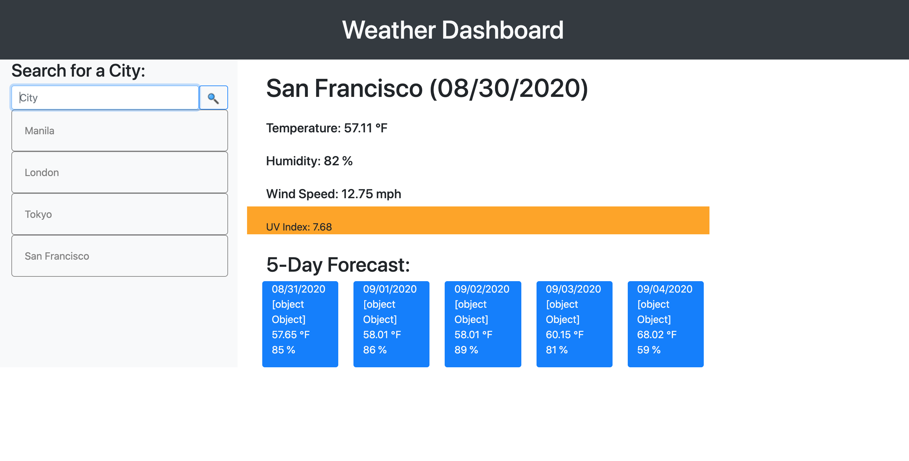

# weather-dashboard
This challenge requires to build a weather dashboard using the OpenWeather API to retrieve weather data for cities. The app will run in the browser and feature dynamically updated HTML and CSS.

## Built with 
*HTML
*CSS
*Javascript

## Website:   https://bibo1011.github.io/weather-dashboard/

## Screenshot:

